<h3><code>adityayedpalwar</code></h3>

  
<h3><code>adi@github ~ $ whoami</code></h3>
<table><tr><td valign="top"></td><td valign="top"></td></tr></table>
 <code>ADITYA /etc/motd</code>  
<strong>Data Science · AI · GenAI · Development</strong>  
<a href="https://github.com/adityayedpalwar">GitHub</a> · <a href="https://github.com/adityayedpalwar?tab=repositories">Repositories</a> · <a href="https://adityayedpalwar.github.io/All-for-one/">Portfolio</a>

